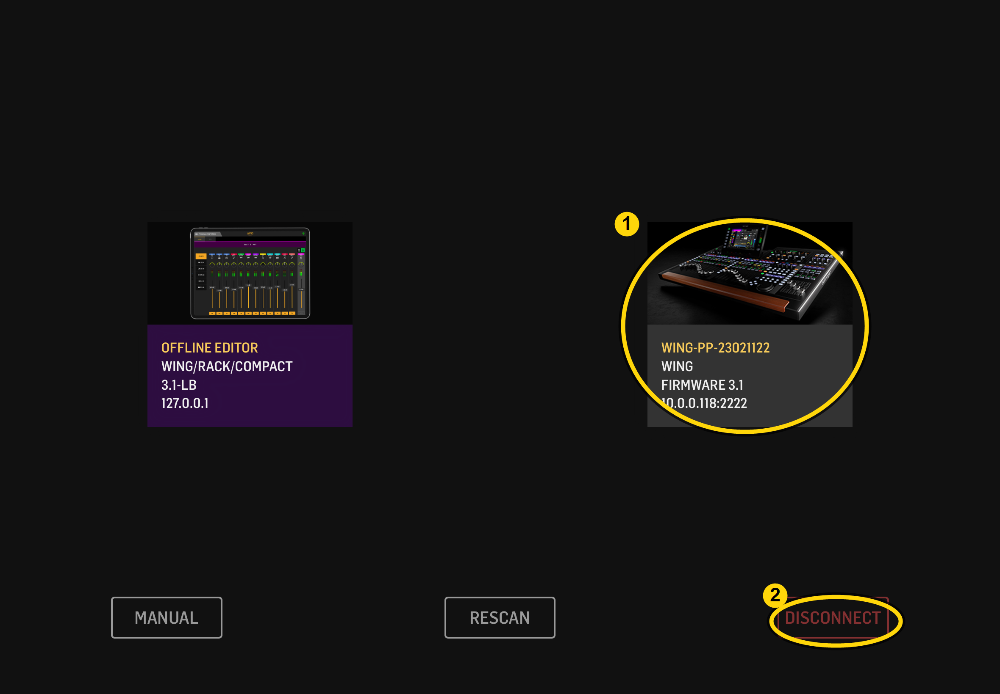
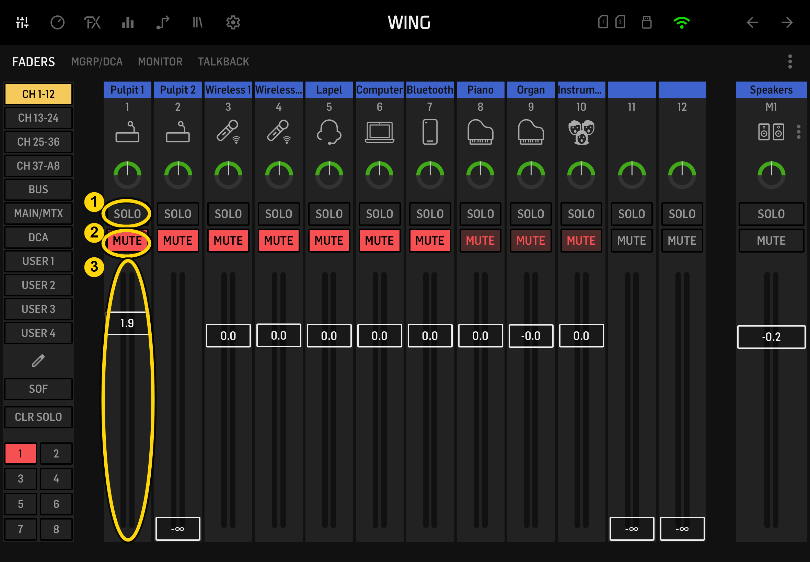
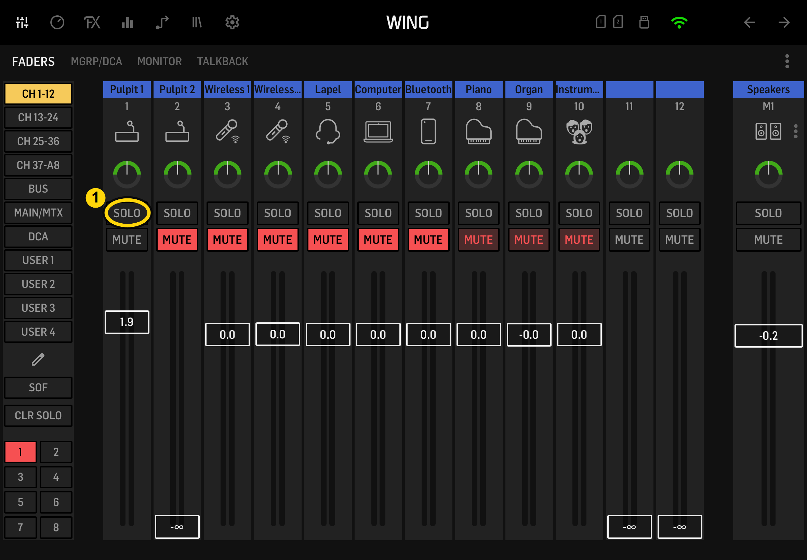
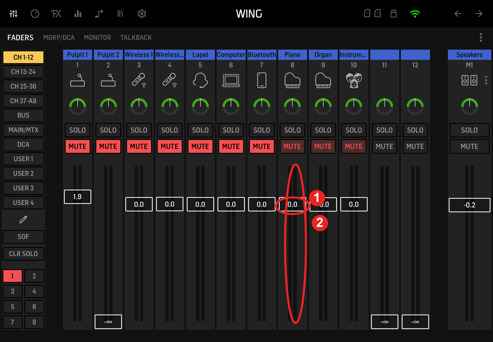
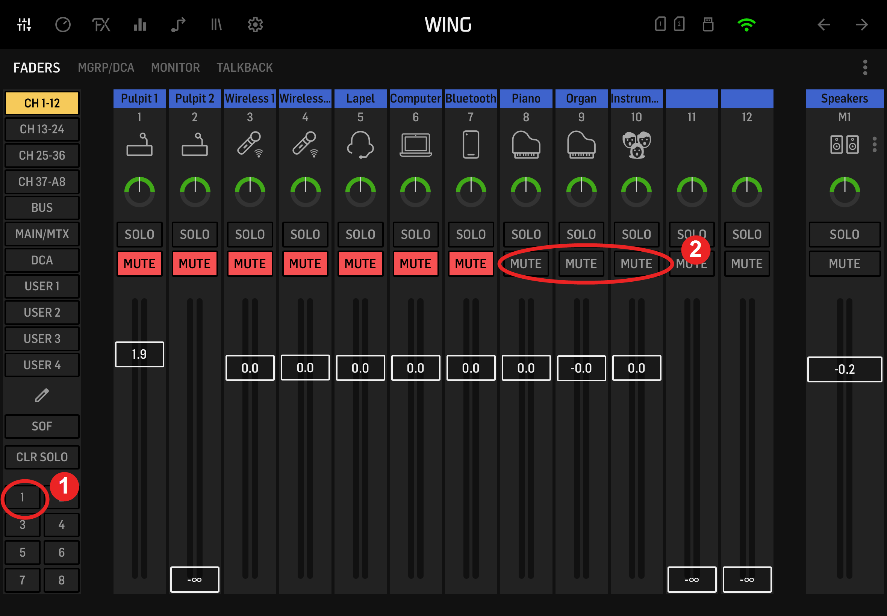
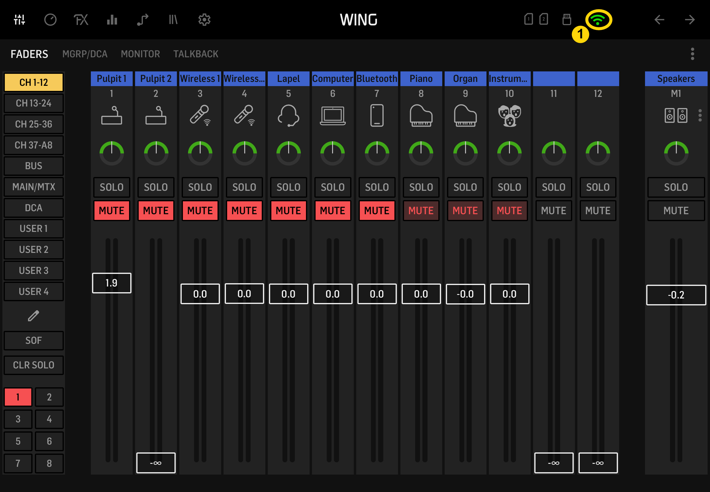

# Controlling Audio

Use the iPad and the `WING CoPilot` app to control Mackey Hall audio levels and mute states during the service.

---

## Before Service

### Confirm the Sound System Is On

Skip this if you already turned on the sound system during setup.

- Go to the sound system rack.
- Find the red `Power` switch. If it is not lit red, turn it on.

 

- Locate the amplifier, third unit from the bottom of the rack.
- Press the amplifier power button at the bottom-right.
- Confirm the button lights blue.

 

### Get the iPad

- Get the iPad from the top drawer of the sound system rack, unless it is already out from setup.
- Wake and unlock the iPad.

## Connect to the Mixer

### Open WING CoPilot

- Open the `WING CoPilot` app.

### Select the Mackey Hall Mixer

- On the WING CoPilot home screen, tap `WING-PP-23021122`.
- Wait for the mixer controls to open.
- Do not use the `Offline Editor` tile for service audio.

Callouts:

1. Tap the Mackey Hall WING mixer tile.
2. Use `Disconnect` only when forcing a reconnect.

 

## During Service

### Main Controls

The main mixer page shows each audio source as a vertical channel strip.

Callouts:

1. `SOLO` is not usually needed for normal service control. It will solo just that one fader and essentially mute all other faders.
2. `MUTE` turns that channel on or off. Red means muted. Gray means unmuted.
3. The vertical fader controls the channel volume. 0.0 is the standard volume.

 

### Unmute One Channel

If only one source is needed, unmute only that source.

- Find the correct channel name at the top of the strip.
- Press that channel's red `MUTE` button.
- Confirm the button turns gray.
- Leave the other channels muted.

Callout:

1. This example shows one channel unmuted while the surrounding channels stay muted.

 

### Adjust Volume with the Sliders

- Move a channel fader up to make that source louder.
- Move a channel fader down to make that source quieter.
- Make small changes and listen before adjusting again.
- Avoid large jumps during the service.

Callouts:

1. The vertical fader is the volume slider for that channel.
2. The number shows the current fader level. `0.0` is the standard volume.

 

### Unmute the Music Microphones Together

The music microphone group is tied to channels 8-10: `Piano`, `Organ`, and `Instrument`. Use this when the music microphones need to come on together.

- Press the small red `1` group button in the lower-left of the screen.
- Confirm the `MUTE` buttons on channels 8-10 turn gray.
- Leave channels muted if they are not being used.

Callouts:

1. The small red `1` button controls the music microphone group.
2. Channels 8-10 are the music microphone channels that should change from red to gray.

 

## Troubleshooting

### Force a Reconnect

Sometimes WING CoPilot appears connected but stops responding correctly. If the app is stale, force a reconnect.

1. On the mixer page, press the green Wi-Fi button at the top.

 

2. On the home screen, press `Disconnect`.
3. Tap `WING-PP-23021122` again to reconnect.
4. Confirm the mixer controls reopen and respond normally.

 
