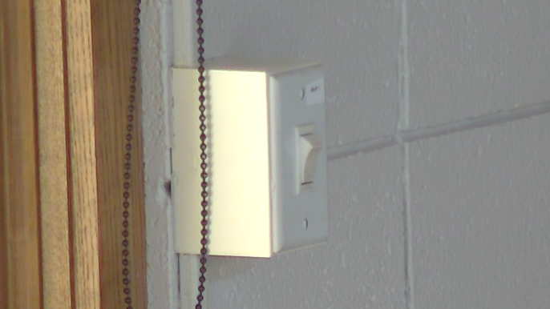

# Setting Up and Powering On

Use this before service to prepare the computer, cameras, sound system, projector, and room controls.

---

## Computer

### Uncover the Desk

- Remove the cover from the computer desk and monitors.

### Power On the Computer

- Press the power button at the top-right of the desktop computer.
- Wait for the computer and monitors to finish starting.

 

### Log In

- Log in with the Westminster account.
- If you do not know the PIN, ask for it.

## Projector and Room Displays

### Lower the Projector Screen

- The projector screen control switch is on the south wall, to the right of the windows.
- Press the lower half of the switch fully in.
- Wait for the screen to lower. It stops automatically.
- Return the switch to the neutral center position after the screen is fully lowered.

 

 

### Turn On the Projector / Rear TV

- Use the Mackey Hall wall touchscreen for projector and rear TV power.
- If the touchscreen is not on the Homepage or `Power` page, press the `Home` icon in the top-left corner.
- If you are on the Homepage, press `Power`.

 

- Press `Projector On` to power on the projector.
- If the rear TV is needed, press `Rear TV` to power it on.
- Allow about 30 seconds for the projector to fully start.

 

## Cameras

### Power On the PTZ Camera

- Use the Mackey Hall wall touchscreen for rear PTZ camera power.
- If the touchscreen is not on the Homepage or `Power` page, press the `Home` icon in the top-left corner.
- If you are on the Homepage, press `Power`.
- Press `PTZ Camera` to power on the camera.

 

### Choose Mevo Cameras

- Get the Mevo cameras from the Mevo / iPad storage location.
- Choose the cameras needed for the service.
- Unplug the selected cameras and place them on stands.
- The stands are located to the right of the sound system rack.

 

### Power On and Place Mevo Cameras

- Hold the Mevo power button until it beeps.
- After each camera powers on, confirm it appears on the right desktop monitor.
- Place the cameras where they are needed for the service.

 

## Audio

### Turn On the Sound System

- Go to the sound system rack.
- Find the red `Power` switch. If it is not lit red, turn it on.

 

- Locate the amplifier, third unit from the bottom of the rack.
- Press the amplifier power button at the bottom-right.
- Confirm the button lights blue.

 

### Get the iPad

- Get the iPad from the top drawer of the sound system rack.
- Place it where it can be used during setup and the service.

### Keep Audio Controls Ready

- Keep the iPad nearby. Use [Controlling Audio](ipad-sound-system.md) when you are ready to connect WING CoPilot, unmute channels, or adjust levels.

### Set Out Microphones

- Place the pulpit microphone in the pulpit.

 

- Verify the handheld and lapel microphones are in the pulpit.

 

- Retrieve the piano and organ microphones from the drawer with the remotes. They are stored in black bags.

 

- Place the piano microphone in the piano after the piano is opened. Place it just behind the music stand, approximately centered. The cable should already be attached to the piano microphone stand.
- Place the organ microphone near the desk, pointed up toward the organ speakers above the chair closet. The stand is near the other microphone stand. Bring the cable from the floor near the sound system rack, run it under the door, and connect it to the microphone.

 

## Service Apps

### Open Computer Programs

- Open these desktop shortcuts:
  - OBS Studio
  - OBS All Cameras
  - Proclaim
  - Facebook
  - YouTube

 

- Minimize Google Chrome after the needed pages are open.
- The three monitors should look similar to this:

 
