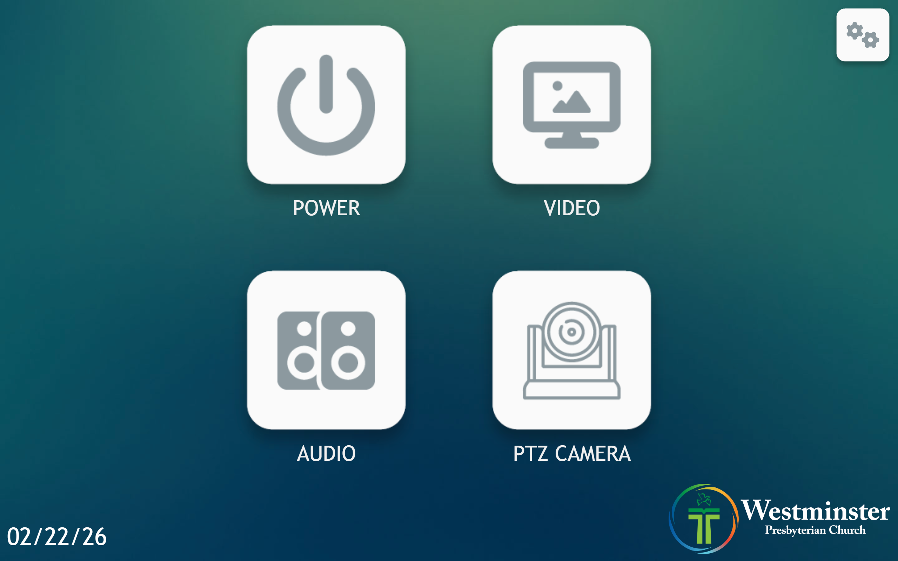
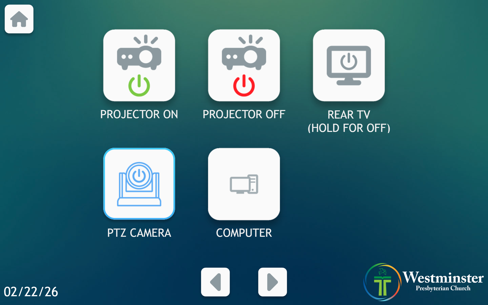
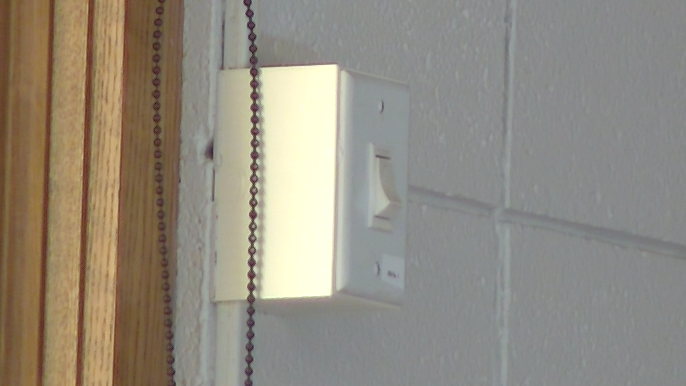

# Shutting Down and Packing Up

Use this after service to stop equipment, return microphones and cameras, and leave Mackey Hall ready for the next use.

---

## Computer

### Close Computer Programs

- Close OBS Studio, OBS All Cameras, Proclaim, Chrome, and any other service-related windows.

### Shut Down the Computer

- Open the Windows Start menu.
- Select `Power`.
- Select `Shut down`.
- Wait for the computer to fully shut down.

## Projector and Room Displays

### Turn Off the Projector / Rear TV

- Use the Mackey Hall wall touchscreen for projector and rear TV power.
- If the touchscreen is not on the Homepage or `Power` page, press the `Home` icon in the top-left corner.
- If you are on the Homepage, press `Power`.

 

- Press `Projector Off` to power off the projector.
- If the rear TV is on, press and hold `Rear TV` for a few seconds to power it off.
- Allow about 30 seconds for the projector to shut down.

 

### Retract the Projector Screen

- The projector screen control switch is on the south wall, to the right of the windows.
- Press the upper half of the switch fully in.
- Wait for the screen to retract. It stops automatically.
- Return the switch to the neutral center position after the screen is fully retracted.

 

 

## Cameras

### Power Off the PTZ Camera

- Use the Mackey Hall wall touchscreen for rear PTZ camera power.
- If the touchscreen is not on the Homepage or `Power` page, press the `Home` icon in the top-left corner.
- If you are on the Homepage, press `Power`.
- Press `PTZ Camera` to power off the camera.

 

### Power Off and Return Mevo Cameras

- Hold the Mevo power button until it beeps.
- Release the button after the first beep. The camera will beep again as it powers off.
- Return the cameras to their storage location.
- Plug the cameras in.
- Return the stands to their storage location.

 

## Audio

### Return the iPad

- Return the iPad to the top drawer of the sound system rack.
- Plug it in so it charges for the next use.

### Turn Off the Sound System Amplifier

- Turn off the amplifier on the sound system rack.
- The amplifier is the third unit from the bottom of the rack.
- Press the power button at the bottom-right. It will click back out and the blue light will turn off.
- Leave the red rack `Power` switch on unless a staff member has specifically asked for the full rack to be shut down.

 

### Return Microphones

- Return the pulpit microphone to the drawer.

 

- Retrieve the piano and organ microphones.
- Return each microphone to its labeled bag.
- Return the stands to where they were found.
- Return the microphone bags to the drawer.

 
