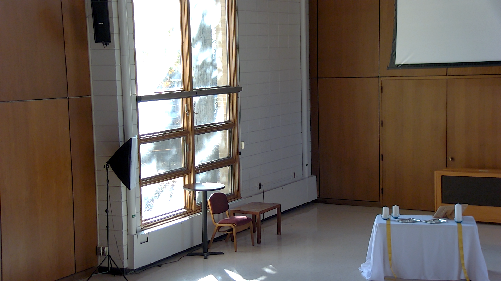
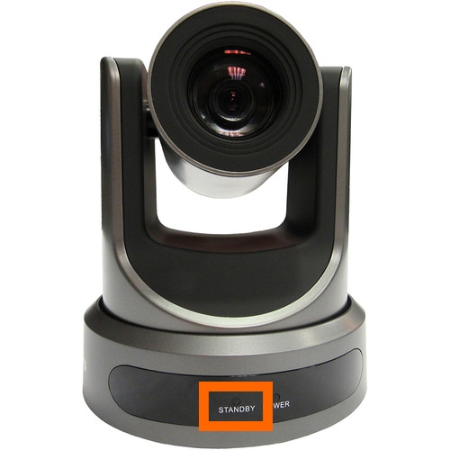
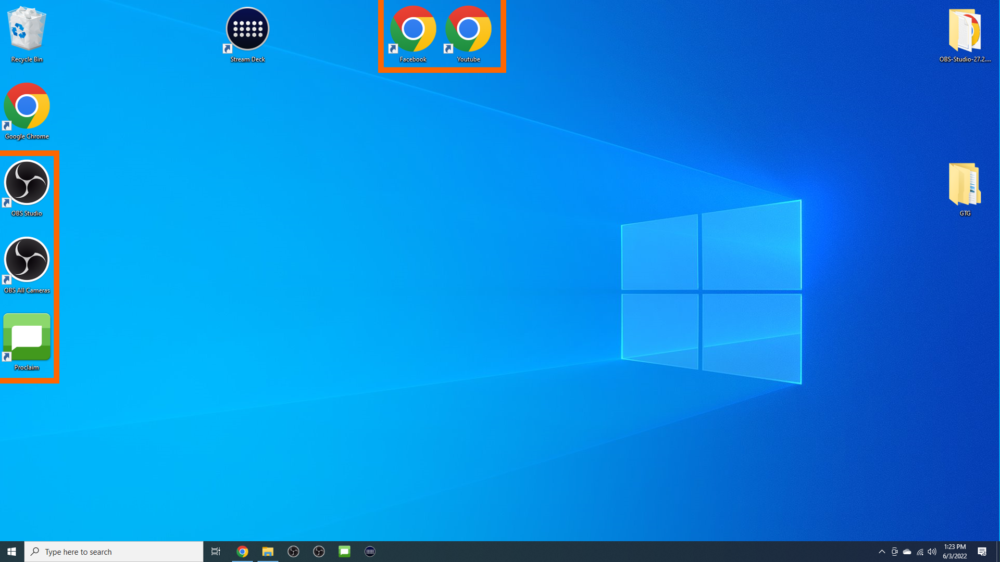
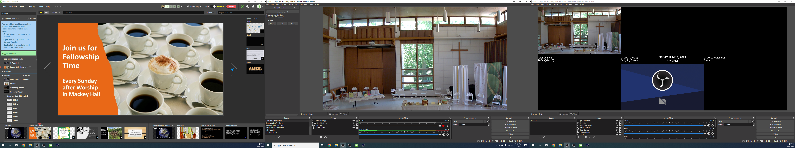

# Setting Up and Powering On Computer / Cameras / Sound System / Projector

Follow the instructions below to get the computer, cameras, sound system, and projector ready to use for the service.

---

## 1. Uncover Computer and Monitors
 - Remove the cover from the computer desk.

## 2. Switch on Power Strip
 - Turn on the power strip located behind the computer.
 - The computer will click on, but then click right back off when you turn on the power strip. This is its normal behavior.
 - The three monitors will also light up with the Dell logo.

## 3. Power on the Computer
 - Press the power switch located at the top right of the desktop.
 - The switch is labelled as to find it easier.
  

## 4. Log On to Computer
 - Log on to the computer using the Westminster account and the pin located on the back of computer.

## 5. Power on Projector / Rear TV
 - Use the wall touchscreen in Mackey Hall for projector and rear TV power.
 - If the touchscreen is not on the Homepage or the `Power` page, press the `Home` icon in the top-left corner.
 - If you are on the Homepage, press `Power` to open the power controls.
  
 - Press `Projector On` to power on the projector.
 - If the rear TV is needed, press `Rear TV` to power it on.
  
 - Allow about 30 seconds for the projector to fully start.

## 6. Open Projector Screen
 - The projector screen control switch is on the south wall, to the right of the windows.
  
 - Press the lower half of the screen control switch fully in.
 - Wait while the screen lowers. It will stop automatically at its lowest position.
 - Toggle the switch back to the neutral center position after the screen is fully lowered.
  

## 7. Power on PTZ Camera
 - Retrieve the remote for the rear PTZ camera.
 - Get somewhere near the camera and press the power button
  
 - The left light on the camera will turn off and it will start moving to find it's home position.
  
 - Return the remote to the drawer.

## 8. Choose Mevo Cameras To Use
 - From the Mevo / iPad storage location, choose which Mevo Cameras you want to use.
  
 - Unplug the cameras you chose and put them on the stands located to the right of the sound system rack.

## 9. Power on and Place Mevo Cameras
 - Power on the Mevo Cameras by holding the power button until it beeps.
     
 - After you power each of these on, you should be able to see them on the right desktop monitor.
 - Place the cameras as you desire.
 - The stands are located to the right of the sound system rack.

## 10. Retrieve and Turn on iPad
 - Get the iPad from the storage location, power it on, and place it on the desk for later.
  

## 11. Turn on Sound System
 - Go to the sound system rack.
 - Find the red `Power` switch on the rack. If the switch is not lit red, turn it on.
  
 - Locate the amplifier in the rack, third unit from the bottom.
 - Press the amplifier power button at the bottom-right.
 - Confirm the button lights blue, which means the amplifier is on.
  

## 12. Connect iPad to Sound System
 - Follow the steps [here](ipad-sound-system.md) to connect to the sound system.

## 13. Set Out Microphones
 - Place the pulpit microphone in the pulpit
  
 - Verify the handheld and lapel microphones are in the pulpit.
  
 - Retrieve the microphones for the piano and organ. They are located in the drawer with remotes in black bags.
   
 - Place the piano and organ microphones.
  
   - The piano microphone will go in the piano once it is opened up. Just behind the music stand, approximately center. The cable is already attached to the piano microphone stand
   - The organ microphone will go near the desk pointed up toward the organ speakers above the chair closet. The stand is near the other microphone stand. The cable is on the floor near the sound system rack. Bring it under the door and connect it to the microphone.

## 14. Open Computer Programs
 - On the computer open the following programs from the desktop.
    - OBS Studio
    - OBS All Cameras
    - Proclaim
    - Facebook
    - Youtube
     
 - Minimize the window for Google Chrome.
 - After this, the windows on the three desk monitors should look something like this:
   

